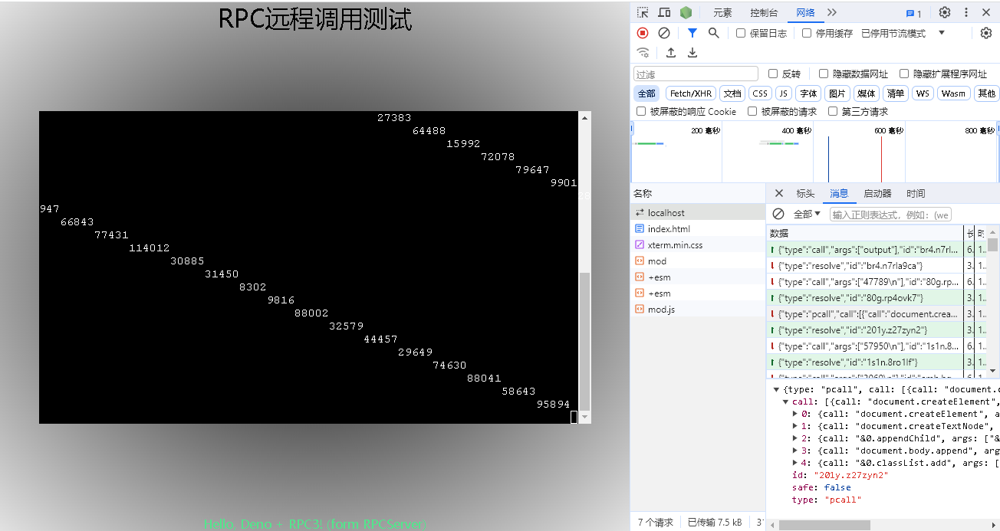

# RPC 3
RPC，在Windows上称作“远程过程调用”。作为系统的关键组件，在WinB上也无可辩驳地成为了通信核心
此RPC3继承了RPC1、2的优秀特性，加入了双向调用(PIPE)功能，且单独剥离
让诸多有双向或短时间内单向调用需求的项目有了更多选择

# rpc_pipe与WebSocket?
如果你需要多个双向连接且希望减小服务器负担，特别是Windows端，强烈建议试试看
如批量任务，16核心运行16个进程，使用16个WebSocket明显不合理。这时rpc_pipe就有了用武之地
rpc_pipe相似于可复用的HTTP2，完全异步调用且支持可恢复队列、自动重连等特性

# 如何开始
RPC3是一个框架，支持 浏览器(browser.ts)、Deno端(直接使用share.ts)、Bun(未测试)
且经过小幅度改动或一个polyfill即可移植到NodeJS

需要提前安装好 `typescript` 和 `deno`，然后：
你可以试试看 `tsc && cd test && deno run -A --unstable-sloppy-imports deno.ts`运行简单的服务器
简单修改即可投入生产使用

